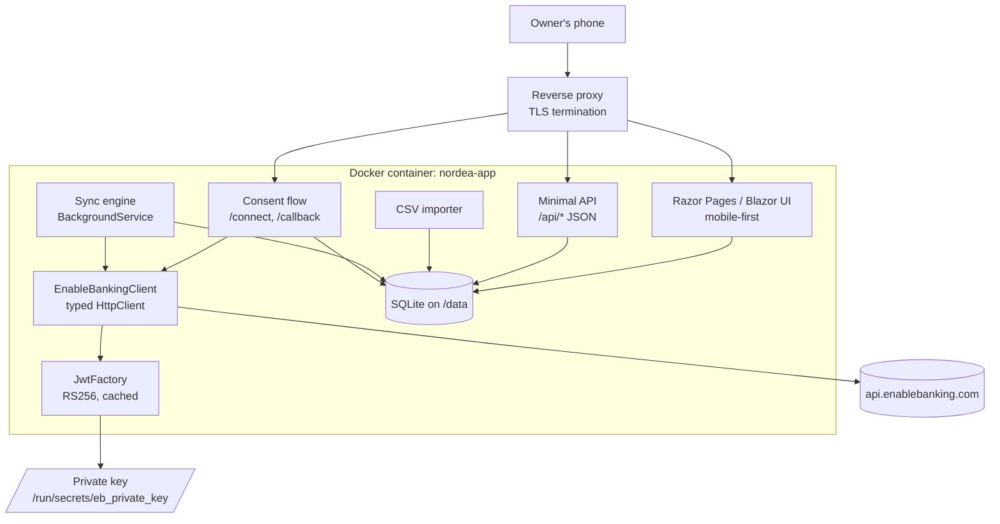
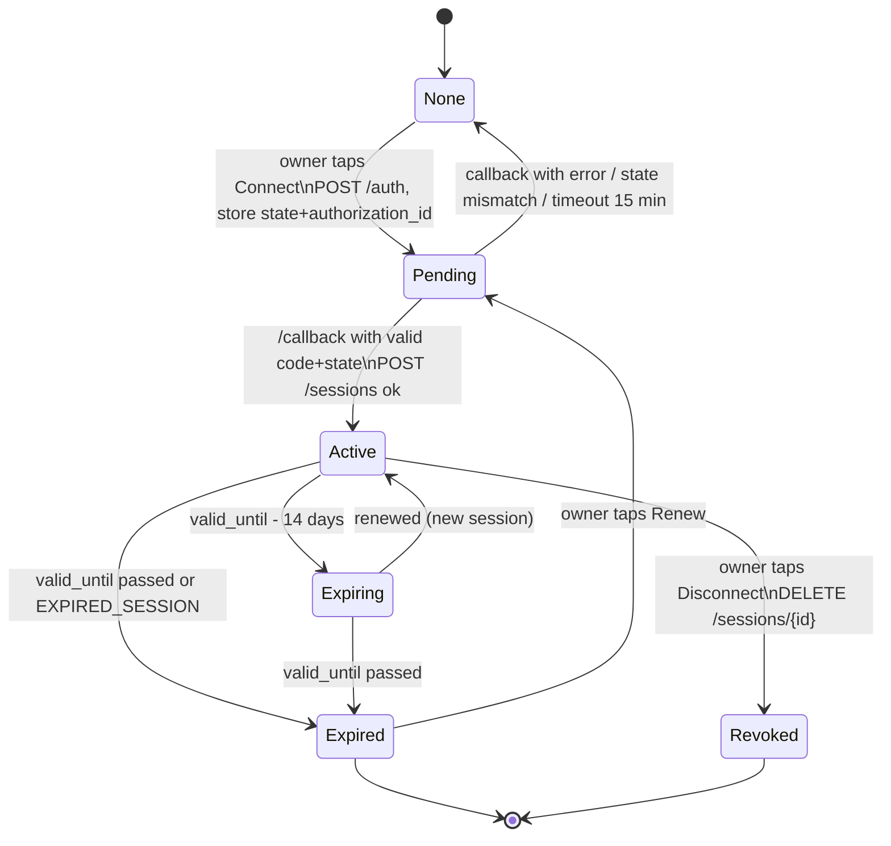
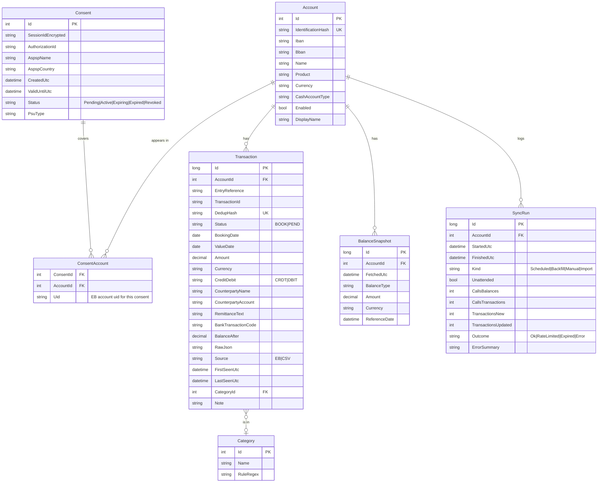

# Developer specification: Nordea transaction app

| | |
|---|---|
| Version | 1.0, 2026-10-02 |
| Status | Draft for developer review |
| Target | C# / ASP.NET Core web app, mobile-first UI, one Docker container on the owner's private server |
| Depends on | [Whitepaper](whitepaper.md) for background, [API reference](api-reference.md) for endpoint details, [Setup checklist](setup-checklist.md) for what the owner does first |

The word **must** marks a requirement. **Should** marks the preferred way
when there is a choice. Anything else is guidance.

## 1. Purpose and scope

The app lets one owner see and keep the transactions and balances of their
own Nordea Denmark accounts, fetched automatically through Enable Banking.

In scope:

* Consent flow with Enable Banking and Nordea (MitID) from a phone browser.
* Full history backfill after each consent, then scheduled incremental sync.
* Local storage of accounts, balances, transactions and sync history.
* Mobile-first web UI: accounts, transactions, search, monthly summaries,
  consent status, manual refresh, export.
* CSV import of Nordea's manual export as a fallback.
* Single Docker image, configuration by environment variables and secrets.

Out of scope:

* Payments or any write operation at the bank.
* Multi-tenant use or serving other people's bank logins.
* Native mobile apps. A responsive web app, installable as a PWA, is enough.
* Categorisation intelligence beyond simple user-defined rules.

## 2. Goals and non-goals

| Goal | Measure |
|---|---|
| Zero manual steps between consents | Transactions appear in the app without the owner opening the Nordea app |
| Never exceed the PSD2 quota | At most 4 unattended fetches per account per day; HTTP 429 never triggers a retry loop |
| Never lose a consent's history | Backfill runs within minutes of consent and is idempotent |
| Owner-operable | Renewal, refresh and import need no developer involvement |
| Replaceable provider | Enable Banking lives behind one interface; CSV import works without it |

## 3. Technology stack

| Concern | Choice | Reason |
|---|---|---|
| Runtime | .NET 10 (LTS). .NET 8 LTS is acceptable if the host needs it. | Supported until 2028; official Docker images |
| Web | ASP.NET Core, Razor Pages or Blazor Server, with minimal API endpoints for JSON | One process, server-rendered, works well on phones |
| UI | Server-rendered HTML + a small CSS framework (e.g. Pico.css or Bootstrap), progressive enhancement; PWA manifest | Light, no JS build pipeline needed |
| Database | SQLite via EF Core (`Microsoft.EntityFrameworkCore.Sqlite`), WAL mode, one file on a Docker volume | Single user, simple backups |
| JWT | `System.IdentityModel.Tokens.Jwt` (as in the official sample) or `Microsoft.IdentityModel.JsonWebTokens` | Matches the vendor sample |
| HTTP | `IHttpClientFactory` typed client with Polly for timeouts only (no automatic retries on 429) | Controlled retry behaviour |
| Scheduling | `BackgroundService` with a simple time-slot scheduler, or Quartz.NET if cron syntax is preferred | Four fixed slots per day |
| Secrets at rest | ASP.NET Core Data Protection with keys persisted on the volume, used to encrypt the session ID and any stored tokens | Standard, no extra dependency |
| Logging | `Microsoft.Extensions.Logging` to console (captured by Docker); Serilog optional | Docker-native |
| Tests | xUnit; `WireMock.Net` or a hand-rolled fake for the Enable Banking API | Deterministic sync tests |

## 4. Architecture



### 4.1 Components

| Component | Responsibility |
|---|---|
| `JwtFactory` | Loads the RSA private key once, mints JWTs (`kid`=app id, `iss`=`enablebanking.com`, `aud`=`api.enablebanking.com`, `iat`, `exp`=now+30 min), caches the token and renews it 5 minutes before expiry. |
| `EnableBankingClient` | Thin typed client over the endpoints in the [API reference](api-reference.md). Adds the bearer token, optional PSU headers, deserialises responses, maps error bodies to typed exceptions. No business logic. |
| `IBankDataSource` | Interface implemented by `EnableBankingClient` and by `CsvImportSource`, so the sync engine and importer write through the same upsert code. |
| `ConsentService` | Starts authorisation, validates `state`, exchanges the code, stores the session, maps accounts, triggers backfill. |
| `SyncEngine` | Scheduler, quota bookkeeping, incremental fetch, backfill, deduplication, sync-run logging. |
| `TransactionStore` | EF Core repository with idempotent upserts. |
| `CsvImporter` | Parses Nordea's CSV export and feeds `TransactionStore`. |
| Web UI | Pages listed in section 10. |

## 5. Configuration and secrets

All configuration comes from environment variables (ASP.NET Core
configuration with `__` as section separator) or mounted files. Nothing
sensitive is baked into the image.

| Key | Required | Example | Notes |
|---|---|---|---|
| `EB__ApplicationId` | yes | `cf589be3-3755-465b-a8df-a90a16a31403` | From the Enable Banking control panel |
| `EB__PrivateKeyPath` | yes | `/run/secrets/eb_private_key` | PEM, PKCS#1 or PKCS#8, RSA 2048 or 4096. Read with `RSA.ImportFromPem`. |
| `EB__BaseUrl` | no | `https://api.enablebanking.com` | Default shown. `api.tilisy.com` is deprecated and must not be used. |
| `EB__RedirectUrl` | yes | `https://nordea.home.example/callback` | Must match the control panel registration exactly |
| `EB__Aspsp__Name` | no | `Nordea` | Default shown |
| `EB__Aspsp__Country` | no | `DK` | Default shown |
| `EB__PsuType` | no | `personal` | Default shown |
| `EB__ConsentDays` | no | `180` | Clamped to `maximum_consent_validity` from `GET /aspsps` |
| `EB__Language` | no | `da` | Passed to `POST /auth` for the consent page language |
| `Sync__Slots` | no | `06:30,11:30,16:30,21:30` | Local time, four entries. Fewer are allowed; more than four must be rejected at startup. |
| `Sync__TimeZone` | no | `Europe/Copenhagen` | For slot evaluation |
| `Sync__OverlapDays` | no | `5` | How far back each incremental fetch starts, relative to the last booked date |
| `Sync__ManualRefreshCooldownMinutes` | no | `10` | Debounce for the "Refresh now" button |
| `App__DataDir` | no | `/data` | SQLite file, Data Protection keys, import staging |
| `App__PublicBaseUrl` | yes | `https://nordea.home.example` | Used for absolute links and cookie settings |
| `App__Auth__Username` | yes | | Single owner login |
| `App__Auth__PasswordHash` | yes | | Argon2id or PBKDF2 hash; never a plaintext password |
| `App__Auth__TotpSecret` | no | | Optional second factor |
| `ASPNETCORE_FORWARDEDHEADERS_ENABLED` | yes | `true` | Behind a reverse proxy |

The private key **must** be provided as a file (Docker secret or read-only
bind mount), not as an environment variable, so it does not appear in
`docker inspect` or process listings.

## 6. Enable Banking client

### 6.1 Authentication

```csharp
// Illustrative; the compilable version is in samples/csharp.
using var rsa = RSA.Create();
rsa.ImportFromPem(File.ReadAllText(options.PrivateKeyPath));
var key = new RsaSecurityKey(rsa) { KeyId = options.ApplicationId };
var creds = new SigningCredentials(key, SecurityAlgorithms.RsaSha256);
var now = DateTimeOffset.UtcNow;
var token = new JwtSecurityToken(
    issuer: "enablebanking.com",
    audience: "api.enablebanking.com",
    claims: new[] { new Claim("iat", now.ToUnixTimeSeconds().ToString(), ClaimValueTypes.Integer64) },
    notBefore: now.UtcDateTime,
    expires: now.AddMinutes(30).UtcDateTime,
    signingCredentials: creds);
// header must contain "kid": application id and "alg": "RS256"
string jwt = new JwtSecurityTokenHandler().WriteToken(token);
```

Rules:

* Token lifetime **must** be well below 24 hours; 30 minutes is the default.
* The factory **must** be thread-safe and cache one token until 5 minutes
  before `exp`.
* The RSA object **must** be created once at startup; never re-read the key
  per request.

### 6.2 Requests

* Base address from configuration, `Accept: application/json`.
* Every request: `Authorization: Bearer <jwt>`.
* Data endpoints (details, balances, transactions) optionally take PSU
  headers. The client **must** send either the complete set or none. The
  set is `Psu-Ip-Address` and `Psu-User-Agent` at minimum; include
  `Psu-Accept-Language` when available. Values come from the owner's
  current HTTP request (use the forwarded client IP, not the proxy's).
* Timeout 60 s. No automatic retry on 4xx. One retry after 2 s on
  network errors and 5xx, except for `POST /sessions`, which is never
  retried (the code is single-use).

### 6.3 Error mapping

| HTTP / `error` code | Exception | Handling |
|---|---|---|
| 401 | `EbAuthException` | JWT problem: log, mark sync run failed, alert in UI. Likely wrong key or app id. |
| 403 | `EbForbiddenException` | App not activated or account not linked. Alert in UI with the setup checklist link. |
| 422 (`EXPIRED_SESSION`, `SESSION_CLOSED`, or similar) | `EbSessionExpiredException` | Mark consent `Expired`, show renewal banner, stop scheduling fetches for that session. |
| 422 `PSU_HEADER_NOT_PROVIDED` | `EbPsuHeaderException` | Bug: header set incomplete. Fail the request. |
| 429 | `EbRateLimitedException` | Quota exhausted. Skip this account until the next slot; never retry immediately. |
| 5xx, timeouts, `ASPSP_ERROR` | `EbTransientException` | One retry, then skip to the next slot. |

Error bodies are JSON; the client **must** log the `error`, `message`
and any `aspsp_error` fields, never the full response for data endpoints.

## 7. Consent flow



### 7.1 Routes

| Route | Method | Behaviour |
|---|---|---|
| `/connect` | POST (auth required, anti-forgery) | Reads ASPSP record from `GET /aspsps` (cached 24 h); computes `valid_until` = now + min(`EB__ConsentDays`, `maximum_consent_validity`); generates `state` = 32 random bytes, base64url; stores a `PendingAuthorization` row; calls `POST /auth`; redirects the browser to the returned `url`. |
| `/callback` | GET (no login required, but `state` must match a pending row younger than 15 min) | On `error` query parameter: show the error, delete pending row. Otherwise `POST /sessions {code}`; store `Consent` with `session_id` (encrypted at rest), `valid_until`, ASPSP; upsert `Account` rows from the response; enqueue the backfill job; redirect to `/accounts` with a success message. |
| `/consent` | GET | Status page: state, valid until, days left, accounts covered, last successful sync, buttons Renew / Disconnect / Refresh now. |
| `/consent/disconnect` | POST | `DELETE /sessions/{id}`, set `Revoked`. Data stays. |

### 7.2 Account matching across consents

Each new consent returns new `uid`s. The app **must** match accounts by
`identification_hash` (falling back to IBAN) so the local `Account` row,
its transactions and the user's settings survive renewal. The previous
`uid` is kept in history for diagnostics.

### 7.3 Zero accounts

If `POST /sessions` returns no accounts, the most likely cause is that the
owner has not linked the account in the Enable Banking control panel
(restricted mode strips unlinked accounts). The app **must** show that
explanation with a link to the [setup checklist](setup-checklist.md).

## 8. Sync engine

### 8.1 Quota model

Per account and per calendar day (Europe/Copenhagen), the engine keeps a
counter of **unattended** calls to each of `balances` and `transactions`.
A paginated transactions fetch counts each page as one call, to stay on
the safe side. The counter **must** never exceed 4 for scheduled work.
Calls that carry PSU headers (manual refresh) are logged but not counted.

### 8.2 Scheduled incremental sync

At each configured slot, plus a deterministic jitter of 0–4 minutes per
account:

1. Skip if the consent is not `Active` or `Expiring`.
2. `GET /accounts/{uid}/balances` (1 call).
3. `GET /accounts/{uid}/transactions?date_from=<lastBookedDate - OverlapDays>&date_to=<today>`;
   follow `continuation_key` until absent (normally 1 call).
4. Upsert, record a `SyncRun` row with counts and duration.
5. On 429: record, mark the account as rate-limited for this slot, continue
   with other accounts.

The engine **must** run a missed slot once if the container was down at
the slot time and it is still the same day and the quota allows it.

### 8.3 Backfill after consent

Started immediately after `POST /sessions` and run with priority:

1. Balances for every account.
2. Transactions in windows of 365 days backwards from today:
   `date_from = today - 365*n - 365`, `date_to = today - 365*n`, paginated.
3. Stop when a window returns zero transactions **and** at least one
   earlier window has been tried past 2 years, or when the API reports the
   lower bound (error about date range). Record the earliest date reached.
4. Backfill calls count against the quota like any unattended call. If the
   owner started the consent from the phone, the backfill **should** pass
   the owner's PSU headers captured at `/callback` for the first hour,
   which makes those calls exempt and also lands inside the full-history
   window.
5. Backfill is idempotent and resumable: progress (`earliestWindowDone`)
   is stored so a restart continues rather than restarts.

### 8.4 Manual refresh

`POST /sync/refresh` (auth required): same as the scheduled sync for all
accounts, but with PSU headers from the current request and a cooldown of
`Sync__ManualRefreshCooldownMinutes`. If the owner's IP is a private
address (LAN), Nordea may still count the call; the UI notes this.

### 8.5 Deduplication and upsert

Natural key, in order of preference:

1. (`AccountId`, `entry_reference`) when `entry_reference` is non-empty.
2. (`AccountId`, `transaction_id`) when present.
3. (`AccountId`, SHA-256 of `booking_date|value_date|amount|currency|credit_debit_indicator|normalised remittance text`).

Rules:

* A `BOOK` record replaces a `PEND` record that matches on key 3 within a
  window of 7 days when key 1/2 differ.
* Updates never delete user data on the row (category, note, tags).
* The raw JSON of every transaction **must** be stored in `RawJson` for
  future re-mapping.

## 9. Data model



Amounts are stored as `decimal` with 2 decimals. Debits are stored as
negative numbers in `Amount` **and** the indicator is kept, so both
conventions are available.

## 10. Web UI

Mobile-first, one column, large tap targets, dark mode following the
system. All pages behind login except `/callback` and `/healthz`.

| Page | Content |
|---|---|
| `/login` | Username, password, optional TOTP. Rate-limited (5 attempts / 15 min). |
| `/accounts` (home) | One card per enabled account: name, masked IBAN, latest booked balance, available balance, last sync time, consent status chip. Pull-to-refresh calls manual refresh. |
| `/accounts/{id}` | Transactions, newest first, infinite scroll (50 per page). Each row: date, counterparty, remittance text (truncated), amount with sign and colour, pending badge. Tap opens detail with all fields and the raw JSON behind a disclosure. |
| `/search` | Text (counterparty, remittance), date range, amount range, account, category, status. |
| `/summary` | Month picker, income vs. spend, top counterparties, per-category totals, simple bar chart (inline SVG, no external JS). |
| `/consent` | As in 7.1. The renewal banner appears on every page from 14 days before expiry and when expired. |
| `/import` | Upload Nordea CSV export; preview mapping; import with the same dedup rules; shows counts. |
| `/export` | Download all or filtered transactions as CSV and JSON. |
| `/settings` | Display names for accounts, categories and rules, slot times (display only, changes need env), change password, TOTP setup. |
| `/system` | Last 50 sync runs, quota used today per account, app version, DB size, log excerpt. |
| `/healthz` | 200 if DB reachable; no auth; no details. |

PWA: `manifest.webmanifest` with icons, `display: standalone`, and a
minimal service worker that caches static assets only (never API data).

## 11. Application security

| Area | Requirement |
|---|---|
| Transport | HTTPS only, HSTS, terminated at the reverse proxy. The container listens on HTTP on an internal network only. |
| Login | Single owner account. Password hashed with Argon2id (or PBKDF2 ≥ 600k iterations). Optional TOTP. Cookie: `Secure`, `HttpOnly`, `SameSite=Lax`, 14-day sliding expiry. |
| CSRF | Anti-forgery tokens on every state-changing form and endpoint. |
| Headers | `Content-Security-Policy` with `default-src 'self'`, `X-Content-Type-Options: nosniff`, `Referrer-Policy: no-referrer`, `Permissions-Policy` minimal. |
| Secrets | Private key read from file at startup, held in memory only. Session ID encrypted with Data Protection before storage. No secret is ever written to logs or rendered in HTML. |
| Logging | Log request paths, status codes, EB error codes and counts. Never log IBANs, balances, amounts, counterparty names or remittance text at Information level. Debug logging of payloads is a build-time switch that is off in the published image. |
| Callback | `state` is single-use, bound to the pending row, expires after 15 minutes. `code` is never logged. |
| Dependencies | `dotnet list package --vulnerable` in CI; Dependabot/Renovate or a monthly manual check. |
| Container | Non-root user, read-only root filesystem, `/data` the only writable mount, no capabilities. |
| Backups | The owner backs up `/data` (SQLite file + Data Protection keys) encrypted; the app provides `/export` as a logical backup. |

## 12. Docker deployment

### 12.1 Image

* Multi-stage build: `mcr.microsoft.com/dotnet/sdk:10.0` to publish,
  `mcr.microsoft.com/dotnet/aspnet:10.0` (or the `-chiseled` variant) to run.
* `USER app`, `EXPOSE 8080`, `ASPNETCORE_URLS=http://+:8080`.
* Health check: `curl -f http://localhost:8080/healthz` or the .NET
  built-in `HEALTHCHECK` equivalent.
* Image tag = git tag; `latest` only for the default branch.

### 12.2 Compose (skeleton in `samples/docker/`)

```yaml
services:
  nordea-app:
    image: registry.example/nordea-app:1.0.0
    restart: unless-stopped
    user: "1000:1000"
    read_only: true
    tmpfs: [/tmp]
    environment:
      EB__ApplicationId: ${EB_APPLICATION_ID}
      EB__PrivateKeyPath: /run/secrets/eb_private_key
      EB__RedirectUrl: https://nordea.home.example/callback
      App__PublicBaseUrl: https://nordea.home.example
      App__Auth__Username: ${APP_USERNAME}
      App__Auth__PasswordHash: ${APP_PASSWORD_HASH}
      Sync__TimeZone: Europe/Copenhagen
      ASPNETCORE_FORWARDEDHEADERS_ENABLED: "true"
      TZ: Europe/Copenhagen
    secrets:
      - eb_private_key
    volumes:
      - nordea-data:/data
    networks: [proxy]
secrets:
  eb_private_key:
    file: ./secrets/eb_private_key.pem
volumes:
  nordea-data:
networks:
  proxy:
    external: true
```

### 12.3 Reverse proxy

Any of Traefik, Caddy, nginx or the Synology reverse proxy. Requirements:
TLS with a certificate the phone trusts, forward `X-Forwarded-For` and
`X-Forwarded-Proto`, proxy WebSockets if Blazor Server is used, and a
request body limit large enough for CSV uploads (10 MB).

The redirect URL registered at Enable Banking is
`${App__PublicBaseUrl}/callback`. If the server is only reachable on the
LAN or over VPN, the owner must be on that network when giving consent.

## 13. Observability

* Structured console logs with a correlation ID per request and per sync run.
* `/system` page as the owner's dashboard; no external monitoring required.
* Optional: Prometheus endpoint with counters `eb_calls_total{endpoint,unattended,outcome}`
  and gauge `consent_days_left`.

## 14. Testing

| Level | What |
|---|---|
| Unit | JWT claims and header (`kid`, `alg`); PSU header all-or-none; dedup key selection; pending→booked replacement; quota counter day rollover in Europe/Copenhagen; slot scheduling with jitter; CSV parser against three real anonymised Nordea exports. |
| Integration (fake API) | WireMock stubs for `/aspsps`, `/auth`, `/sessions`, balances, transactions with `continuation_key`, 429, 422 `EXPIRED_SESSION`. Verify the engine never makes a 5th unattended call. |
| Sandbox | Enable Banking sandbox application with the `Mock ASPSP` and, if listed, the Nordea sandbox; full consent flow from a phone. |
| Production smoke | Owner's real consent; verify backfill depth and that the four daily slots run for a week without 429. |

## 15. Acceptance criteria

1. From a phone, the owner connects Nordea with MitID and sees all linked
   accounts within one minute.
2. The full available history is present within 15 minutes of consent.
3. Over 7 days, every account has 4 scheduled sync runs per day and no 429.
4. Manual refresh returns new transactions and does not change the
   unattended counters.
5. Stopping the container for a day and starting it again produces exactly
   one catch-up run and no duplicates.
6. Renewal 14 days before expiry keeps account IDs, categories and notes.
7. Importing the same CSV twice yields zero new rows the second time.
8. No IBAN, amount or counterparty appears in container logs at the
   default level.
9. The image runs as non-root with a read-only root filesystem.
10. `dotnet test` passes in the GitLab pipeline.

## 16. Open questions for the owner

See [whitepaper, section 11](whitepaper.md#11-open-points-for-the-owner).
The developer should get answers before phase 2.

## Appendix A: minimal flow in C#

A compilable console version of the client is in `samples/csharp/`. The
essential calls, with the exact JSON names:

```csharp
// 1. Start authorisation
var auth = await client.PostAsync<StartAuthorizationResponse>("/auth", new
{
    access = new { valid_until = validUntil.ToString("o"), balances = true, transactions = true },
    aspsp = new { name = "Nordea", country = "DK" },
    state = state,
    redirect_url = redirectUrl,
    psu_type = "personal",
    language = "da"
});
// auth.url -> open in the owner's browser; auth.authorization_id -> store

// 2. Callback arrives as GET {redirect_url}?code=...&state=...
var session = await client.PostAsync<AuthorizeSessionResponse>("/sessions", new { code });
// session.session_id, session.accounts[i].uid, .account_id.iban, .identification_hash, session.access.valid_until

// 3. Data
var balances = await client.GetAsync<HalBalances>($"/accounts/{uid}/balances");
string? key = null;
do
{
    var page = await client.GetAsync<HalTransactions>(
        $"/accounts/{uid}/transactions?date_from={from:yyyy-MM-dd}&date_to={to:yyyy-MM-dd}" +
        (key is null ? "" : $"&continuation_key={Uri.EscapeDataString(key)}"));
    Upsert(page.transactions);
    key = page.continuation_key;
} while (!string.IsNullOrEmpty(key));
```

## Appendix B: Nordea CSV import mapping

Nordea DK exports are semicolon-separated with a header row and Danish
number formatting (`1.234,56`). The importer **must** detect the delimiter
and decimal separator, accept both UTF-8 and Windows-1252, and map at least:
booking date, text, amount, balance after, and, when present, value date
and counterparty. The exact column names are to be confirmed against a
fresh export during phase 3; store an example (anonymised) under
`samples/csv/` when available.
