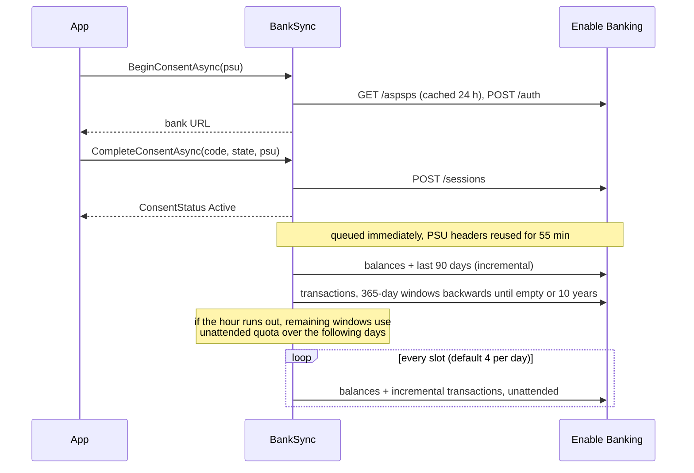

# BankSync library guide

| | |
|---|---|
| Version | 0.1.0, 2026-10-02 |
| Source | `src/BankSync` in this repository |
| Audience | The app developer |

BankSync is the C# library that implements everything the
[developer specification](developer-spec.md) says about talking to Enable
Banking, keeping within the PSD2 quota, backfilling history and storing
data. The app developer builds the user interface on top of one interface,
`IBankSync`, and never calls Enable Banking directly.

## What the library takes off your hands

| Concern | Handled by BankSync |
|---|---|
| JWT (RS256, `kid`, `iss`, `aud`, 24 h max) | `JwtFactory`, cached, renewed 5 min before expiry |
| Consent: `POST /auth`, callback `state`, `POST /sessions`, 180-day limit from `GET /aspsps` | `BeginConsentAsync` / `CompleteConsentAsync` |
| Full history right after consent, while the bank still exposes it | Backfill queued immediately, reusing the owner's PSU headers for 55 minutes |
| Four unattended calls per account per endpoint per day | `QuotaGuard` counts every call; scheduled work asks first; 429 is recorded, never retried |
| Scheduled sync at fixed local times, catch-up after a restart | `SyncScheduler` (a `BackgroundService`) |
| Deduplication, pending → booked replacement, user notes preserved | `SyncEngine.UpsertAsync` |
| Expired or revoked sessions | `ConsentStatus.State` becomes `Expired`; `NeedsRenewal` is true |
| Storage | SQLite via EF Core; session id encrypted at rest with a key file |
| Account identity across renewals | `identification_hash` |

What it does **not** do: user login, HTML, payments, CSV import of Nordea's
manual export (planned), schema migrations (0.1 uses `EnsureCreated`).

## Install and register

Project reference (this repository) or NuGet once published:

```bash
dotnet add package BankSync
```

```csharp
using BankSync;

var builder = WebApplication.CreateBuilder(args);

// Option A: bind the "BankSync" configuration section
builder.Services.AddBankSync(builder.Configuration);

// Option B: in code
builder.Services.AddBankSync(o =>
{
    o.ApplicationId  = "…";                       // Enable Banking control panel
    o.PrivateKeyPath = "/run/secrets/eb_private_key";
    o.RedirectUrl    = "https://nordea.home.example/callback";
    o.DatabasePath   = "/data/banksync.db";
});
```

The registration adds a `DbContextFactory`, a typed `HttpClient`, two hosted
services (database initialiser and scheduler) and `IBankSync` as a
singleton. It validates the options at start-up and throws
`BankSyncConfigurationException` with a clear message if something is
missing.

### Configuration keys

| Key (`BankSync:` section) | Default | Meaning |
|---|---|---|
| `ApplicationId` | required | Enable Banking application id |
| `PrivateKeyPath` or `PrivateKeyPem` | required | RSA private key, PEM |
| `RedirectUrl` | required | Must equal the URL registered at Enable Banking |
| `BaseUrl` | `https://api.enablebanking.com` | |
| `AspspName`, `AspspCountry`, `PsuType` | `Nordea`, `DK`, `personal` | Any ASPSP from `GET /aspsps` works |
| `Language` | `da` | Consent page language |
| `ConsentDays` | 180 | Clamped to the bank's `maximum_consent_validity` |
| `DatabasePath` | `banksync.db` | SQLite file; directory is created |
| `SecretKeyPath` | next to the database | AES key for the session id |
| `EnableScheduler` | true | Set false when the host drives `RunScheduledSyncAsync` itself |
| `SyncSlots` | `06:30,11:30,16:30,21:30` | At most `MaxUnattendedCallsPerDay` entries |
| `TimeZone` | `Europe/Copenhagen` | Slot times and quota day boundary |
| `MaxUnattendedCallsPerDay` | 4 | PSD2 limit |
| `OverlapDays` | 5 | Incremental window starts this far before the last booked date |
| `ManualRefreshCooldown` | 10 min | Debounce for `RefreshNowAsync` |
| `BackfillMaxYears`, `BackfillWindowDays` | 10, 365 | How far back and in what steps |
| `BackfillPsuWindow` | 55 min | Reuse the consent PSU headers for backfill this long |
| `RenewalWarningDays` | 14 | `Expiring` state before expiry |

Environment variable form: `BankSync__ApplicationId`, `BankSync__SyncSlots__0`, and so on.

## The three endpoints your app must provide

```csharp
static PsuContext Psu(HttpContext http) => new(
    http.Connection.RemoteIpAddress?.ToString() ?? "0.0.0.0",
    http.Request.Headers.UserAgent.ToString(),
    http.Request.Headers.AcceptLanguage.ToString());

// 1. Start: redirect the owner to the bank
app.MapPost("/connect", async (IBankSync bank, HttpContext http) =>
    Results.Redirect((await bank.BeginConsentAsync(Psu(http))).ToString()));

// 2. Callback: the URL registered at Enable Banking
app.MapGet("/callback", async (IBankSync bank, HttpContext http, string? code, string state, string? error, string? error_description) =>
{
    if (error is not null || code is null)
    {
        await bank.CancelConsentAsync(state, error, error_description);
        return Results.Redirect("/?error=" + Uri.EscapeDataString(error ?? "no_code"));
    }
    await bank.CompleteConsentAsync(code, state, Psu(http));   // stores session + accounts, queues backfill
    return Results.Redirect("/");
});

// 3. Manual refresh button
app.MapPost("/refresh", async (IBankSync bank, HttpContext http) =>
{
    await bank.RefreshNowAsync(Psu(http));
    return Results.Redirect("/");
});
```

Always pass a `PsuContext` built from the owner's own request. It marks
the call as "user present", which Enable Banking and the bank exempt from
the daily quota. Behind a reverse proxy, enable forwarded headers so
`RemoteIpAddress` is the phone's address and not the proxy's.

## Reading data

All read methods query SQLite only. They are safe to call on every page
render.

```csharp
var status   = await bank.GetConsentStatusAsync();         // State, DaysLeft, NeedsRenewal, LastSuccessfulSync, BackfillComplete
var accounts = await bank.GetAccountsAsync();              // Id, Iban, MaskedIban, Name, DisplayName, Currency, Earliest/LatestTransactionDate
var balances = await bank.GetBalancesAsync(accounts[0].Id); // latest snapshot per balance type (CLBD = booked, ITAV = available)
var page     = await bank.GetTransactionsAsync(new TransactionQuery
{
    AccountId = accounts[0].Id, From = new DateOnly(2026, 1, 1), Text = "netto", Skip = 0, Take = 50
});
var months   = await bank.GetMonthlySummaryAsync(accountId: null, months: 12);
var tx       = await bank.GetTransactionAsync(page.Items[0].Id);   // includes RawJson from Enable Banking
```

`TransactionInfo.Amount` is signed: debits negative, credits positive,
regardless of how the bank reported it. `IsPending` is true for `PEND`.

User data: `UpdateTransactionUserDataAsync(id, category, note, tags)` and
`SetAccountDisplayNameAsync` / `SetAccountEnabledAsync`. These fields are
never touched by a sync.

## Showing consent state

```csharp
var s = await bank.GetConsentStatusAsync();
switch (s.State)
{
    case ConsentState.None:
    case ConsentState.Expired:
    case ConsentState.Revoked:  // show "Connect Nordea" button
    case ConsentState.Expiring: // show "Renew" banner with s.DaysLeft
    case ConsentState.Active:   // normal
    case ConsentState.Pending:  // owner is at the bank right now
}
```

`NeedsRenewal` collapses this to one boolean.

## Diagnostics

```csharp
var quota   = await bank.GetQuotaStatusAsync();     // per account: calls used today vs. limit, 429 seen today
var history = await bank.GetSyncHistoryAsync(50);   // runs with outcome, counts, errors; AccountId == null rows are summaries
var app     = await bank.VerifyCredentialsAsync();  // one GET /application; proves key + app id
```

Register an `IBankSyncListener` to be told about state changes, new
transactions or completed runs, for example to push a notification:

```csharp
builder.Services.AddSingleton<IBankSyncListener, MyListener>();
```

## Timeline of a fresh install



## Behaviour on errors

| Event | Library behaviour | What the app sees |
|---|---|---|
| HTTP 429 | Account marked rate-limited for the day; next attempt at the next slot | `SyncOutcome.RateLimited` in history, `QuotaStatus.RateLimitedToday` |
| `EXPIRED_SESSION` (any 4xx with EXPIRED/SESSION_CLOSED) | Consent set to `Expired`, scheduler idle | `ConsentStatus.NeedsRenewal == true` |
| 401 | Logged as error; nothing changes | `SyncOutcome.Error` with "401 UNAUTHORIZED" in history |
| 5xx, timeout | Account skipped this slot | `SyncOutcome.Error` |
| Bank rejects an old date range during backfill | Backfill marked complete at that point | `AccountInfo.BackfillComplete == true` |
| Zero accounts in the session | Logged warning | `ConsentStatus.AccountCount == 0`: show the "link accounts in the control panel" hint |

## Running the tests

```bash
dotnet test BankSync.slnx
```

The tests run against an in-process fake of the Enable Banking API and a
fake clock, so they cover quota day rollover, backfill resumption over
several days, PSU header presence, deduplication and expiry without
network access.

## Trying it against the sandbox

1. Register a **sandbox** application at Enable Banking, download the key.
2. `cd samples/BankSync.DemoApp`, set user secrets:

```bash
dotnet user-secrets set BankSync:ApplicationId <sandbox app id>
dotnet user-secrets set BankSync:PrivateKeyPath C:\path\to\sandbox.pem
```

3. Register `https://localhost:5001/callback` as a redirect URL for the
   sandbox app, then `dotnet run` and open <https://localhost:5001/>.
4. Click **Connect**, log in to the Mock ASPSP (credentials in Enable
   Banking's "Sandbox credentials" docs), and watch the transactions appear.

## Roadmap

| Version | Planned |
|---|---|
| 0.2 | EF Core migrations, CSV import of Nordea exports, `IBankSync.ExportAsync` (CSV/JSON) |
| 0.3 | Multiple consents (several banks) under one database, `Psu-Geo-Location` support |
| 1.0 | Stable public API, NuGet release |
