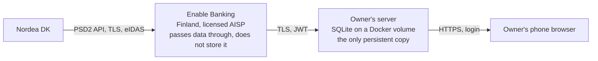

# Privacy and risks: short summary

| | |
|---|---|
| Version | 1.0, 2026-10-02 |
| Audience | Owner and developer |

## Where the data flows

Three parties see the data: Nordea (already has it), Enable Banking (in
transit, states it does not store or process it for other purposes) and
the owner's own server. Nobody else, unless the server is compromised or
backups leak.

## What the app can and cannot do

* **Read-only.** Restricted production has no payment initiation. Even a
  stolen private key cannot move money. It can read balances and
  transactions of the linked accounts until the consent expires.
* **Own accounts only.** Enable Banking strips any account that is not
  linked in the control panel, so the key is useless against other people's
  accounts.
* **Time-boxed.** Every consent ends after at most 180 days and needs
  MitID again. Revoking is one API call, or done in the Enable Banking
  control panel, or at Nordea.

## Main risks and how they are limited

| Risk | Likelihood | Impact | Mitigation |
|---|---|---|---|
| Server or database compromised; full transaction history exposed | Low on a private, patched server | High: financial profile of the household, counterparty names | TLS, single-user login with strong password and optional TOTP, container as non-root and read-only, no public exposure beyond what the phone needs (VPN preferred), encrypted backups, keep the OS and image patched |
| Private key leaks (committed to git, left in a chat, in an env var) | Medium if careless | Medium: read access to the linked accounts until revoked | Key as a Docker secret file only, `.gitignore` blocks `*.pem`, never in env vars or logs; rotate by registering a new key in the control panel |
| Phishing during the MitID redirect | Low | High: MitID credentials | Only ever start the flow from the app; check that the address bar shows `enablebanking.com` and then Nordea/MitID; never approve a MitID prompt you did not initiate |
| Enable Banking changes or ends the free restricted mode | Medium over years (GoCardless precedent) | Low: automation stops, data stays | Provider behind an interface, CSV import of Nordea's manual export, full export of local data |
| Breaching the 4-per-day quota and being throttled or blocked | Low with the fixed scheduler | Low | Hard counter in the app, no retry loops on 429 |
| Logs or error reports leak amounts and names | Medium if not designed in | Medium | Logging rules in the spec: no financial fields at default level; debug payload logging off in production |
| Backups unencrypted on a NAS or cloud | Medium | High | Encrypt backups; treat the SQLite file like a bank statement |
| Session expires early (bank certificate rotation, KYC) | Medium | Low | App detects `EXPIRED_SESSION`, shows renewal banner, two-tap renewal |
| Data of third parties (counterparties) stored on the owner's server | Certain | Low | GDPR household exemption applies to purely personal use, but keep retention reasonable and never share the database |

## Legal notes in brief

* The owner is the PSU and gives consent under PSD2; Enable Banking is
  the regulated party towards Nordea. The owner needs no licence for
  personal use of their own accounts.
* Enable Banking's terms for restricted production allow only the owner's
  own, linked accounts. Serving family members with their own Nordea
  logins would require a commercial agreement.
* Processing counterparties' names for personal household purposes falls
  under the GDPR household exemption. That exemption ends if the data is
  shared outside the household or used for other purposes.
* Nordea's terms are respected because access happens through the PSD2
  interface and SCA, not through automation of the customer UI.

## Owner's checklist

- [ ] Private key exists only on the server (and in an encrypted offline copy).
- [ ] Redirect URL uses HTTPS and is only reachable where intended.
- [ ] Strong, unique app password; TOTP enabled if offered.
- [ ] Backups of `/data` are encrypted.
- [ ] Review the consent in the Enable Banking control panel at each renewal; revoke anything unexpected.
- [ ] Know how to revoke at Nordea (netbank → third-party access) if the server is lost.
