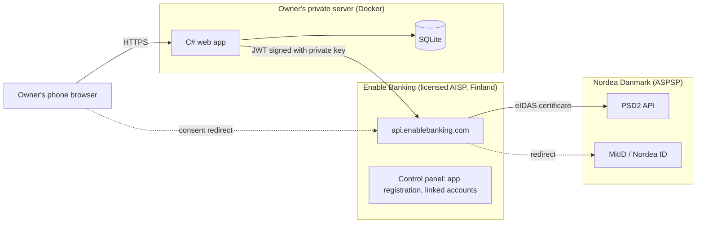
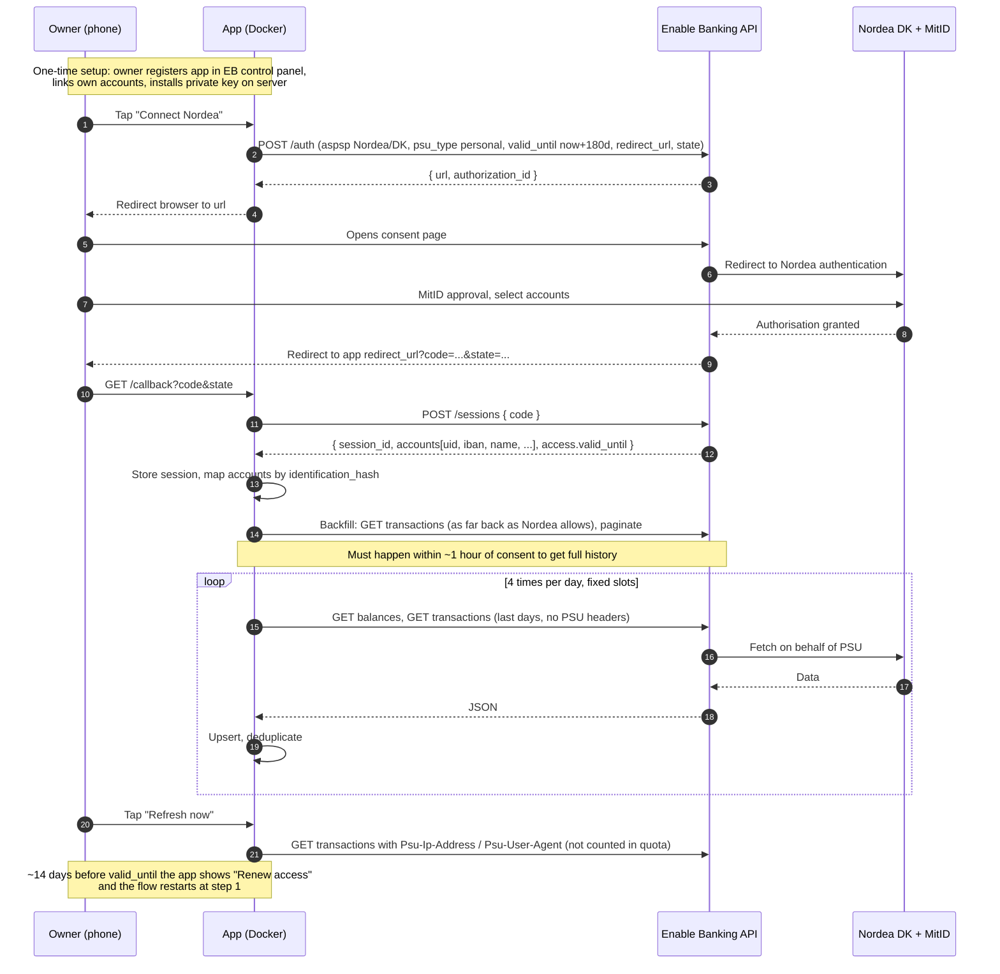

# Whitepaper: reading Nordea Denmark transactions from your own app

| | |
|---|---|
| Version | 1.0, 2026-10-02 |
| Status | Draft for owner review |
| Audience | Owner and app developer |
| Scope | One private Nordea Denmark customer, read-only access to their own accounts, self-hosted app |

## 1. Executive summary

A private Nordea Denmark customer wants their own app to receive account
transactions automatically, instead of exporting CSV files from the Nordea
app by hand.

The EU payment services directive (PSD2) obliges Nordea to expose exactly
this data through an API, but only to **licensed** third-party providers.
A private person cannot obtain that licence, so the app cannot talk to
Nordea directly.

**Enable Banking** (Helsinki, Finland) is a licensed account information
service provider that sits between your app and Nordea. It has a free
**restricted production** mode intended for exactly this case: no contract,
your own accounts only, read-only. The owner registers an application,
links their Nordea accounts in the Enable Banking control panel and approves
access once with MitID. From then on the app fetches balances and
transactions as JSON through a documented REST API.

The recommendation is to build a small C# (ASP.NET Core) web app, packaged
as a Docker container on the owner's private server, that:

1. holds the Enable Banking private key and application ID,
2. guides the owner through the MitID consent on the phone,
3. backfills the full transaction history immediately after consent,
4. then syncs four times a day within the PSD2 quota,
5. stores everything in a local database and shows it on a mobile-friendly web UI,
6. warns before the 180-day consent expires and lets the owner renew in two taps.

The rest of this paper explains the options that were considered, the
regulatory rules that shape the design, the end-to-end flow, the hard
constraints and their consequences, and a phased roadmap.

## 2. Problem statement

Nordea's mobile and web banking offer a transaction archive export
(CSV/Excel). Producing it is a manual, multi-step task per account and per
period, the format is meant for humans, and nothing can trigger it
programmatically. Any tool that wants a running, up-to-date view of
transactions, such as a household budget, a spending dashboard or an
import into bookkeeping software, needs a machine-readable feed that works
without the owner opening the Nordea app.

The owner's requirements:

| # | Requirement |
|---|---|
| R1 | Transactions and balances for the owner's Nordea DK accounts arrive automatically. |
| R2 | The data lives on the owner's own server, not in a third-party cloud. |
| R3 | The owner uses the app from a mobile phone. |
| R4 | No ongoing cost beyond the server already in place. |
| R5 | Nothing may be able to move money. |
| R6 | The approach must comply with Nordea's terms and with Danish/EU law. |

## 3. Options considered

| Option | Works for a private person? | Cost | Legal/terms | Verdict |
|---|---|---|---|---|
| **A. Nordea Open Banking portal directly** (PSD2 "compliance" APIs) | No. Production access requires a PSD2 licence from a national FSA plus an eIDAS QSealC certificate. Only the sandbox is open. | Licence and certificate, tens of thousands of EUR plus ongoing compliance | Fully compliant | Not feasible |
| **B. Enable Banking, restricted production** (own accounts, no contract) | Yes. Designed for personal use and evaluation. | Free | Compliant; Enable Banking is the licensed AISP, the owner gives explicit consent | **Recommended** |
| **C. Commercial aggregators** (Tink, Plaid, TrueLayer, Mastercard Open Banking) | Technically yes, but they onboard companies with contracts, KYB checks and volume pricing. | Monthly minimums | Compliant | Over-sized |
| **D. GoCardless Bank Account Data** (formerly Nordigen, used to be the free option) | No. Closed to new sign-ups and being wound down. | n/a | n/a | Not available |
| **E. No-code sync products** (e.g. Moneysheets to Google Sheets) | Yes | Subscription | Compliant | Data leaves the owner's server; conflicts with R2 and R4 |
| **F. Manual CSV export** from netbank/app | Yes | Free | Compliant | The status quo; keep as a fallback import |
| **G. Screen-scraping the Nordea web/app** with the owner's MitID | Technically possible, practically fragile | Free | Breaches Nordea's terms, defeats MitID's purpose, breaks on every UI change | Rejected |

### 3.1 Is Enable Banking the only way?

Not the only way in theory, but the only one that satisfies all six
requirements. Options A and C are legally clean but either impossible or
disproportionate for one household. Options E and F fail the automation or
self-hosting requirements. Option G is rejected on compliance grounds.
Other self-serve AISPs exist in Europe, but at the time of writing none
combines Nordea DK coverage, a documented free own-accounts mode and a
stable API the way Enable Banking does.

The design should nevertheless assume the provider can change its terms.
The precedent is Nordigen: free for years, then acquired and closed to new
users. Section 8 covers how the app stays useful if that happens.

## 4. Regulatory background in plain terms

| Term | Meaning for this project |
|---|---|
| **PSD2** | EU directive (2015/2366) that forces banks to give licensed third parties access to payment accounts when the customer consents. Nordea's API exists because of it. |
| **ASPSP** | "Account Servicing Payment Service Provider", the bank. In the API, Nordea DK is the ASPSP with name `Nordea` and country `DK`. |
| **AISP** | "Account Information Service Provider", a licensed third party that may read account data. Enable Banking is the AISP; your app is a client of the AISP. |
| **PISP** | Payment initiation. Not granted in restricted mode and not wanted (requirement R5). |
| **PSU** | "Payment Service User", the owner. |
| **SCA** | Strong Customer Authentication. In Denmark this is MitID (or Nordea ID app/device) during the consent redirect. |
| **Consent validity** | Nordea DK allows at most 180 days per consent. After that the PSU must authenticate again. |
| **Four-per-day rule** | The PSD2 technical standards (RTS Art. 36(5)) allow an AISP to fetch data without the user present at most four times per day per account, unless the bank agrees otherwise. Fetches made while the user is actively using the app are not limited, and are signalled by sending "PSU headers" (the user's IP address and user agent). |
| **Restricted production** | Enable Banking's own term for a production application that is activated without a contract by linking the owner's own accounts. The backend strips any account that is not linked. |

### 4.1 Who is responsible for what

* Nordea verifies Enable Banking's licence and certificate, authenticates
  the owner with MitID and enforces the consent and quota rules.
* Enable Banking normalises the bank's API into one JSON format, manages
  the bank-side tokens, and passes data through without storing it.
* The owner's app authenticates to Enable Banking with an RSA key, decides
  when to fetch, stores the data and presents it.

## 5. How Enable Banking works

### 5.1 Application identity

The owner registers an application in the Enable Banking control panel and
uploads a public certificate (or lets the browser generate the key pair).
Enable Banking returns an **application ID**. The matching **private key**
stays on the owner's server and never leaves it.

Every API call carries a short-lived JSON Web Token (JWT) in the
`Authorization: Bearer` header. The JWT is signed with the private key
(RS256), has the application ID as `kid`, `iss` = `enablebanking.com`,
`aud` = `api.enablebanking.com`, and a lifetime of at most 24 hours.

### 5.2 Consent (authorisation) and session

A **session** represents one consent by one PSU for one bank. The app
starts it with `POST /auth`, which returns a URL. The owner opens that URL,
chooses Nordea's MitID login, approves the account access, and is redirected
back to the app's registered **redirect URL** with a one-time `code`. The
app exchanges the code with `POST /sessions` and receives a `session_id`
and the list of accounts with their internal `uid`s.

The session stays valid until the `valid_until` the app asked for, capped
by Nordea's 180 days. Enable Banking refreshes the underlying bank tokens
itself; the app only has to watch the expiry date.

### 5.3 Data

With a valid session the app calls:

* `GET /accounts/{uid}/balances`
* `GET /accounts/{uid}/transactions?date_from=&date_to=` with
  `continuation_key` pagination
* `GET /accounts/{uid}/details` (once, for IBAN, name, currency)

Transactions come back in a normalised ISO 20022-flavoured structure:
amount and currency, credit/debit indicator, booking/value dates, status
(booked/pending), creditor and debtor names and accounts, remittance text,
bank transaction code, and where Nordea supplies it, the balance after
the transaction.

## 6. End-to-end flow

## 7. Constraints and the design consequences

| Constraint (source) | Consequence for the app |
|---|---|
| Consent lasts at most 180 days (Enable Banking changelog, Nordea) | Store `valid_until`; show a renewal banner from 14 days before; handle `EXPIRED_SESSION` errors at any time by prompting renewal; sessions can expire early (bank certificate rotation, KYC). |
| Unattended fetches: 4 per account per day (PSD2 RTS, Enable Banking FAQ) | Fixed schedule with four slots; never retry in a loop on HTTP 429; back off to the next slot. Manual refresh sends PSU headers and is exempt. |
| Full history only for ~1 hour after consent, then ~90 days (Enable Banking FAQ) | Run the backfill job immediately after `POST /sessions`, before anything else; fetch in yearly windows backwards until the bank returns nothing. |
| Restricted mode strips unlinked accounts (Enable Banking FAQ) | Setup checklist for the owner; the app shows a clear message if the session returns zero accounts. |
| Only all-or-none PSU headers are accepted (API reference) | A helper builds the full header set from the owner's request; the scheduler sends none. |
| JWT lifetime max 24 h (API reference) | Mint JWTs on demand with a short lifetime (e.g. 30 min) and cache until near expiry. |
| Private key must never leave the server (getting started guide) | Mount it as a Docker secret or read-only file; never log it; never serve it. |
| Enable Banking stores nothing (FAQ) | The local database is the system of record; back it up, encrypted. |
| Nordea DK accounts are identified by IBAN and by reg.nr/account number (BBAN) | Store both; match accounts across consents with `identification_hash`. |
| Redirect URL must match registration exactly and should be HTTPS | Terminate TLS at a reverse proxy on the private server; the phone must be able to reach that URL (LAN, VPN or public DNS). |
| Pending transactions may change ID when they are booked (common across banks) | Deduplicate on `entry_reference` when present, otherwise on a hash of date, amount and text; let a booked record replace a pending one. |
| The free tier could be withdrawn (GoCardless precedent) | Keep a CSV import for Nordea's manual export and keep all data exportable; the Enable Banking client is one adapter behind an interface. |

## 8. Nordea Denmark specifics

* ASPSP identifier in the API: `{"name": "Nordea", "country": "DK"}`.
  The app should read the live list from `GET /aspsps` rather than
  hard-code it, and display `maximum_consent_validity` and
  `required_psu_headers` from that record.
* Authentication is redirect-based. Nordea's page offers MitID, Nordea ID
  app and Nordea ID device. Private customers use MitID.
* `psu_type` is `personal`. Business brands (Nordea Corporate, First Card)
  are separate and irrelevant here.
* Account access is 180 days per consent.
* Currency is DKK; EUR accounts are uncommon.
* Nordea's own portal documents the data model behind Enable Banking's
  normalised view (Accounts API v5). Transaction fields the owner should
  expect: booking and value date, amount, counterparty name, message/
  remittance text, and a running balance on most account types.

## 9. Costs

| Item | Cost |
|---|---|
| Enable Banking restricted production | Free, no card, no contract |
| Nordea | No charge for PSD2 access |
| Server | Already in place (Docker host) |
| TLS certificate | Free (Let's Encrypt or an internal CA) |
| Development | The developer's time; the API surface is small (about six endpoints) |

If the owner ever wants to serve other people (family members with their
own Nordea logins), that is public production: contract, KYB and volume
pricing. The restricted mode is per **linked account**, so a second person
would have to link their accounts under the same Enable Banking account,
which is not what it is intended for. Treat the app as single-household.

## 10. Recommendation and roadmap

**Build option B** as specified in the [developer specification](developer-spec.md).

| Phase | Deliverable | Notes |
|---|---|---|
| 0. Owner setup | Enable Banking account, production app in restricted mode, accounts linked, private key handed to the server | [Setup checklist](setup-checklist.md). Takes about an hour. |
| 1. Sandbox walkthrough | Developer runs the C# sample against the Enable Banking sandbox (`Mock ASPSP` or Nordea sandbox) | Proves JWT, redirect and session handling before touching real data. |
| 2. Minimum app | Consent flow, backfill, four-slot sync, transaction list, balances, renewal banner, Docker image | Enough to retire the manual CSV routine. |
| 3. Quality of life | Search and filters, categories/tags, monthly summaries, CSV/JSON export, CSV import of Nordea's manual export | Makes the data useful and provides the fallback. |
| 4. Hardening | Encrypted backups, audit log, second-factor login, dependency updates pipeline on GitLab | See [privacy and risks](privacy-and-risks.md). |

## 11. Open points for the owner

1. **Reachability of the redirect URL from the phone.** LAN-only, VPN, or a
   public hostname with a reverse proxy? This decides the HTTPS setup.
2. **How many accounts** should be linked (current account, savings,
   shared accounts)? Each one costs one slot of the daily quota per fetch.
3. **Retention.** Keep everything forever, or purge after N years?
4. **Who else may log in** to the app? Single user is assumed.

## References

* Enable Banking API reference: <https://enablebanking.com/docs/api/reference/>
* Enable Banking getting started (JWT, keys, environments): <https://enablebanking.com/docs/api/>
* Enable Banking FAQ (restricted mode, 4-per-day rule, history window, data retention): <https://enablebanking.com/docs/faq/>
* Enable Banking, open banking specifics in Denmark: <https://enablebanking.com/docs/markets/dk/>
* Enable Banking, Nordea availability page: <https://enablebanking.com/open-banking-apis/fi28583949/>
* Enable Banking changelog, 180-day Nordea consent: <https://enablebanking.com/blog/2023/08/20/changelog-july-2023>
* Enable Banking API samples (C#, Python, others): <https://github.com/enablebanking/enablebanking-api-samples>
* Nordea Open Banking developer portal: <https://developer.nordeaopenbanking.com/>
* Nordea: how to get access to live PSD2 data: <https://support.nordeaopenbanking.com/hc/en-us/articles/115001933430-How-do-I-get-access-to-live-PSD2-data>
* Nordea: eIDAS QSealC onboarding FAQ: <https://support.nordeaopenbanking.com/hc/en-us/articles/7947626168220-eIDAS-QsealC-Certificate-PSD2-Onboarding-Compliance-APIs-Production-Access-FAQ>
* Nordea Accounts API v5 documentation: <https://documentation.nordeaopenbanking.com/compliance/personal/accounts/accounts-v5>
* Free signup vs production access in self-serve PSD2 providers (dev.to, 2026): <https://dev.to/johnfrandsen/free-signup-vs-production-access-what-self-serve-psd2-providers-actually-gate-306p>
* Free and indie open banking APIs 2026 (Open Banking Tracker): <https://www.openbankingtracker.com/guides/free-open-banking-apis>
* Home Assistant Enable Banking integration (worked example of quota and consent handling): <https://github.com/andrei-marinache/ha-enablebanking>
* Firefly III data importer, Enable Banking tutorial (worked example of restricted mode): <https://docs.firefly-iii.org/tutorials/data-importer/eb/>
* Mastercard Open Banking help article on Nordea Nordics (authentication choices): <https://openbankingeu.mastercard.com/help-article/nordics-dk-se-no-fi-nordea/>
